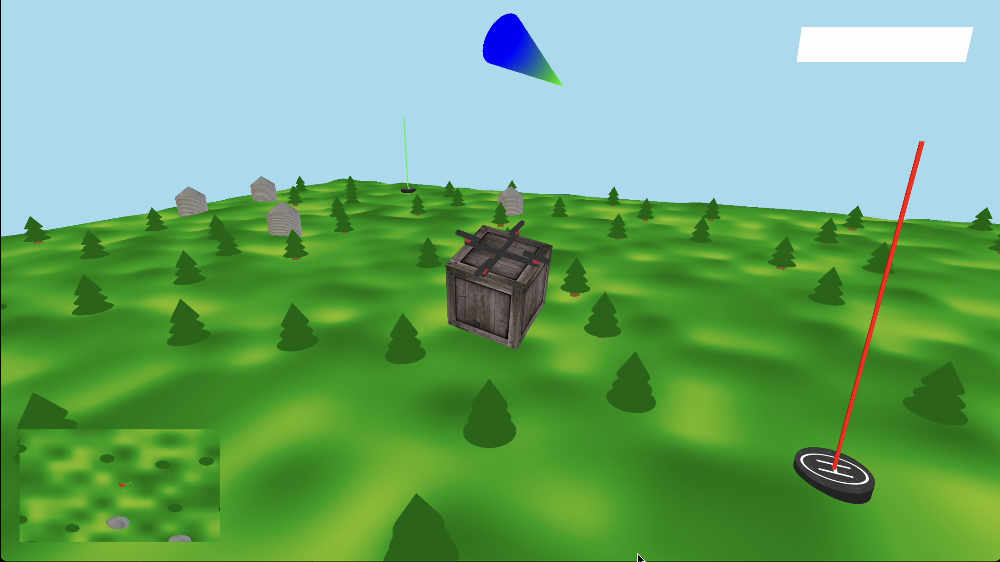

# 🚁 SkyLogistics: 3D Drone Delivery Simulator 📦

## 🎮 Fly, Deliver, Conquer! 🏆

**SkyLogistics** puts you in control of a delivery drone navigating through a procedurally generated landscape! Maneuver through pine forests, avoid obstacles, and make precise deliveries in this immersive 3D simulator.

## About the Game 🌲

This screenshot showcases the game's beautiful procedurally generated terrain with over 700 rendered objects - from dense pine forests to scattered farm silos. At the center, you'll spot a delivery package waiting to be picked up, while the drone's designated landing zone is marked by a helipad with a red indicator beam for enhanced visibility. The minimap in the lower corner helps you navigate this expansive world!

## Technical Highlights ⚙️

* Built with C/C++ and OpenGL with custom vertex/fragment shaders
* Realistic physics engine with gravity effects and responsive drone dynamics
* Procedural terrain generation with optimized rendering for smooth performance
* Collision detection system for interactive environment

---

*Take to the skies and become the ultimate delivery pilot in this challenging simulator!*